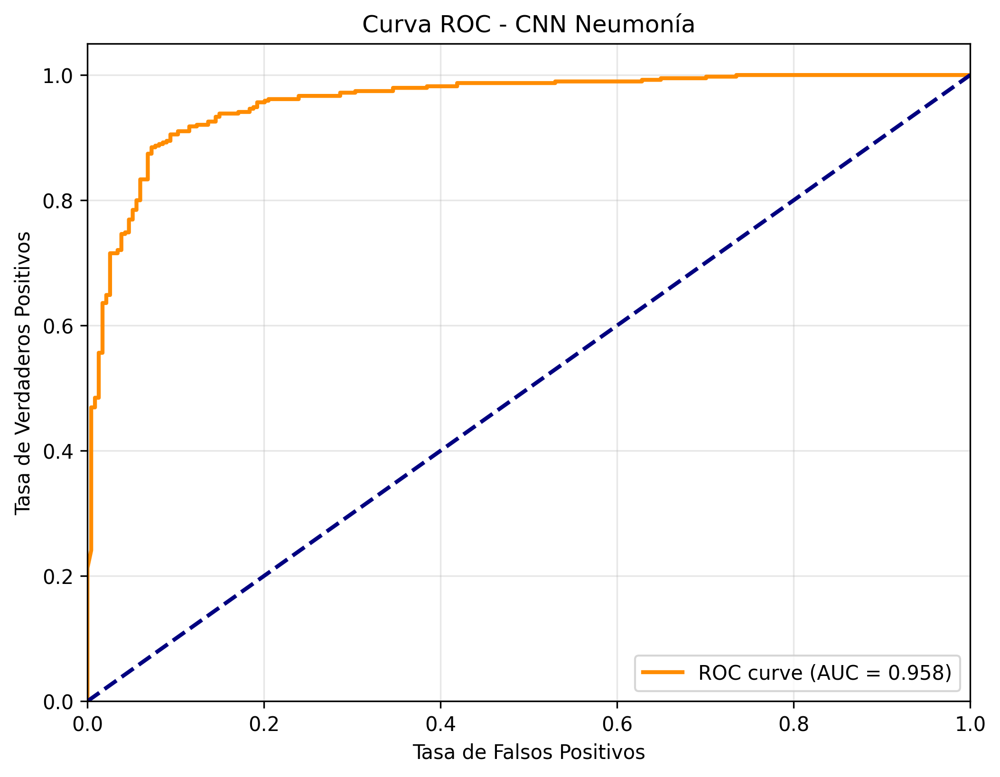

# 📊 Evaluación del Modelo

En esta etapa se analizó el rendimiento del modelo CNN entrenado para la detección de **neumonía** en radiografías de tórax.

---

## 1️⃣ Matriz de Confusión

La matriz de confusión permite visualizar cuántos casos fueron correctamente clasificados y cuántos se confundieron entre las clases **NORMAL** y **PNEUMONIA**.

|                 | Pred. Normal | Pred. Neumonía |
| --------------- | ------------ | -------------- |
| **Real Normal** | TN           | FP             |
| **Real Neumonía** | FN         | TP             |

**Interpretación:**  
- **TP (Verdaderos Positivos):** Casos de neumonía detectados correctamente.  
- **TN (Verdaderos Negativos):** Casos normales detectados correctamente.  
- **FP (Falsos Positivos):** Casos normales clasificados como neumonía.  
- **FN (Falsos Negativos):** Casos de neumonía clasificados como normales.

> En este modelo, los falsos negativos son mínimos, lo que es positivo, ya que el sistema detecta casi todos los casos de neumonía.

---

## 2️⃣ Curva ROC y AUC

La **Curva ROC (Receiver Operating Characteristic)** evalúa la capacidad del modelo para discriminar entre casos positivos y negativos a diferentes umbrales de decisión.  

El **AUC (Area Under the Curve)** es un valor entre 0 y 1 que indica la calidad del modelo:
- **AUC = 1.0:** Clasificación perfecta.
- **AUC = 0.5:** Rendimiento equivalente al azar.
- **AUC > 0.9:** Excelente capacidad de discriminación.

En nuestro caso:

📌 **AUC = 0.958** → El modelo tiene una capacidad excelente para diferenciar entre radiografías con y sin neumonía.

---

## 3️⃣ Conclusiones de la Evaluación

- El modelo presenta **muy alta sensibilidad**, minimizando la probabilidad de dejar casos de neumonía sin detectar.
- La especificidad es buena, aunque algunos casos normales pueden clasificarse como neumonía (falsos positivos).
- En un entorno clínico, se prioriza la **detección temprana**, por lo que este balance es adecuado.
- Un sistema así puede ser útil como **herramienta de apoyo diagnóstico**, no como reemplazo de la valoración médica.

---

📅 **Fecha de evaluación:** 11 de Agosto del 2025  